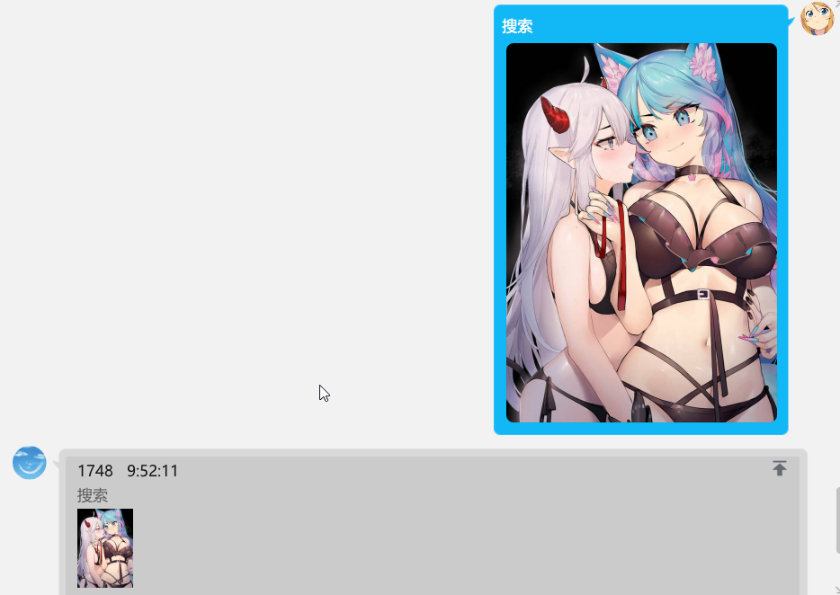
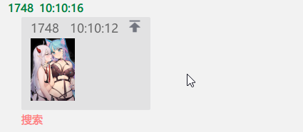

# [Pixiv Helper](https://github.com/cssxsh/pixiv-helper)

> 基于 [Mirai Console](https://github.com/mamoe/mirai-console) 的 [Pixiv](https://www.pixiv.net/) 插件

基于 Kotlin Pixiv库 [PixivClient](https://github.com/cssxsh/pixiv-client) ，通过清除ServerHostName 绕过SNI审查，免代理

目前没有自动缓存清理，请使用 [#删除指令](#删除指令) 手动清理  
R18图会按照Pixiv所给信息过滤  
群聊模式使用默认账号，私聊模式Pixiv账号和QQ号关联，初次使用请先 `/pixiv` 指令登陆账号  
然后使用 `/cache recommended` 缓存系统推荐作品，然后再使用色图相关指令  
Gif图片需要由机器人自己合成，如果设备性能不足，请调整相关参数  
群聊默认输出最少作品信息，需要增加请使用 `/setting` 指令修改  
发送模式可以使用 `/setting` 指令修改为闪照或撤销或转发  
注意, 闪照等模式 并不会降低 `机器人被封禁` 的风险。  
机器人被封禁的主要风险来自

* QQ号是新注册的
* Bot挂在服务器上，但是服务器IP被腾讯列为风险IP(腾讯通过IP确定 登录地区)
* Bot被高频使用，(另外，`高频发图再高频撤销`属于不打自招，正常用户有这个手速吗？)
* 发送大量违规链接，或者触发关键词

[](https://github.com/cssxsh/pixiv-helper/releases)
[](https://shields.io/category/downloads)
[](https://mirai.mamoe.net/topic/289)

## 指令

注意: 使用前请确保可以 [在聊天环境执行指令](https://github.com/project-mirai/chat-command)  
带括号的`/`前缀是可选的  
`<...>`中的是指令名，由空格隔开表示或，选择其中任一名称都可执行例如`/色图`  
`[...]`表示参数，当`[...]`后面带`?`时表示参数可选  
`{...}`表示连续的多个参数

`bookmark` 参数指收藏数过滤
`fuzzy` 参数指模糊搜索

### Pixiv相关操作指令

| 指令                                     | 描述                                       |
|:-----------------------------------------|:-------------------------------------------|
| `/<pixiv> <login> [username] [password]` | APP 不再支持 账号 密码 直接登录，指令做废  |
| `/<pixiv> <sina>`                        | 扫码登录关联了PIXIV的微博账号，以登录PIXIV |
| `/<pixiv> <cookie>`                      | 从文件 读取 Web Cookie，登录PIXIV          |
| `/<pixiv> <refresh> [token]`             | 登录 通过 refresh token                    |
| `/<follow> <user> {uid}`                 | 为当前助手关注指定用户                     |
| `/<follow> <copy> [uid]`                 | 关注指定用户的关注                         |
| `/<mark bookmark> <add> [uid] {words}?`  | 添加指定作品收藏                           |
| `/<mark bookmark> <delete> [pid]`        | 删除指定作品收藏                           |
| `/<mark bookmark> <random> [tag]?`       | 随机发送一个收藏的作品                     |
| `/<mark bookmark> <list>`                | 显示收藏列表                               |

cookie 文件为工作目录下的 `cookie.json`  
内容 为 浏览器插件 [EditThisCookie](http://www.editthiscookie.com/) 导出的Json  
EditThisCookie 安装地址
[Chrome](https://chrome.google.com/webstore/detail/editthiscookie/fngmhnnpilhplaeedifhccceomclgfbg)
[Firefox](https://addons.mozilla.org/firefox/downloads/file/3449327/editthiscookie2-1.5.0-fx.xpi)
[Edge](https://microsoftedge.microsoft.com/addons/getproductdetailsbycrxid/ajfboaconbpkglpfanbmlfgojgndmhmc?hl=zh-CN&gl=CN)

### 色图相关指令

| 指令                                                  | 描述                                  |
|:------------------------------------------------------|:--------------------------------------|
| `(/)<ero 色图 涩图>`                                  | 缓存中随机一张色图                    |
| `(/)<get 搞快点 gkd> [pid] [flush]?`                  | 获取指定ID图片                        |
| `(/)<tag 标签> [word] [bookmark]? [fuzzy]?`           | 随机指定TAG图片                       |
| `(/)<boom 射爆 社保> [limit]? [word]?`                | 随机一组色号图，默认30张              |
| `(/)<illustrator 画师> <uid id user 用户> [uid]`      | 根据画师UID随机发送画师作品           |
| `(/)<illustrator 画师> <name 名称 名字 推特> [name]`  | 根据画师name或者alias随机发送画师作品 |
| `(/)<illustrator 画师> <alias 别名> [name] [uid]`     | 设置画师alias                         |
| `(/)<illustrator 画师> <list 列表>`                   | 显示别名列表                          |
| `(/)<illustrator 画师> <info 信息> [uid]`             | 获取画师信息                          |
| `(/)<illustrator 画师> <search 搜索> [name] [limit]?` | 搜索画师                              |
| `(/)<search 搜索 搜图> [image]?`                      | saucenao 搜索图片                     |
| `(/)<ascii2d> [image]?`                               | ascii2d 搜索图片                      |

色图指令基于缓存信息，使用前请先缓存一定量的作品，推荐使用 `/cache recommended` 指令  
使用色图指令时 指令后附带 `更好`, 可以使收藏数比前一张更高, 如果两次色图指令间隔小于触发时间(默认时间10s)也会触发这个效果  
tag指令检索结果过少时，会自动触发缓存  
tag指令可以尝试按照格式`角色名(作品名)`检索角色, 举例 `红(明日方舟)`  
tag指令多keyword时，请使用 `_`，`|`，`,`, `+` 等符号将keyword连接起来，不要使用空格，举例 `明日方舟+巨乳`  
`[image]?`为空时会从`回复消息`，`最近图片`获取  

画师别名的`uid`为0时表示删除指定别名  

搜图使用 <https://saucenao.com> 的 api，无KEY时，每天限额 100次， KEY参数在设置中添加  
举例:  
  
  
  
  

### 缓存指令

| 指令                                    | 描述                           |
|:----------------------------------------|:-------------------------------|
| `/<cache> <follow>`                     | 缓存关注推送                   |
| `/<cache> <rank> [mode] [date]?`        | 缓存指定排行榜信息             |
| `/<cache> <recommended>`                | 缓存推荐作品，ERO过滤          |
| `/<cache> <bookmarks> [uid]?`           | 缓存用户的收藏中缓存色图作品   |
| `/<cache> <following> [fluhsh]? [uid]?` | 缓存关注画师作品               |
| `/<cache> <fms> [jump]? [uid]?`         | 缓存关注画师收藏的作品         |
| `/<cache> <user> [uid]`                 | 缓存指定画师作品               |
| `/<cache> <tag> [tag]`                  | 缓存搜索tag得到的作品，ERO过滤 |
| `/<cache> <search>`                     | 缓存搜索记录                   |
| `/<cache> <stop>`                       | 停止当前助手缓存任务           |
| `/<cache> <reply> [open]`               | 是否回复缓存细节，默认为否     |

`[uid]?` 会自动填充当前用户

RankMode

```
MONTH

WEEK
WEEK_ORIGINAL
WEEK_ROOKIE

DAY
DAY_MALE
DAY_FEMALE
DAY_MANGA
```

### 任务指令

| 指令                                         | 描述                |
|:---------------------------------------------|:--------------------|
| `/<task> <user> [uid] [duration]?`           | 推送用户新作品      |
| `/<task> <rank> [mode]`                      | 推送排行榜新作品    |
| `/<task> <follow> [duration]?`               | 推送关注用户作品    |
| `/<task> <recommended> [duration]?`          | 推送推荐作品        |
| `/<task> <backup> [duration]?`               | 数据自动备份        |
| `/<task> <web> [pattern] [link] [duration]?` | 推送，从url链接获取 |
| `/<task> <trending> [duration]? [times]?`    | 推送热门标签        |
| `/<task> <detail>`                           | 查看任务详情        |
| `/<task> <delete> [name]`                    | 删除任务            |

备份文件优先推送到群文件，其次百度云  
duration 单位分钟，默认3小时

### 设置指令

| 指令                              | 描述                           |
|:----------------------------------|:-------------------------------|
| `/<setting> <interval> [sec]`     | 设置连续发送间隔时间, 单位秒   |
| `/<setting> <forward>`            | 设置Task发送模式               |
| `/<setting> <link>`               | 设置是否显示Pixiv Cat 原图链接 |
| `/<setting> <tag>`                | 设置是否显示TAG INFO           |
| `/<setting> <attr>`               | 设置是否显示作品属性           |
| `/<setting> <cooling>`            | 设置cooling置零                |
| `/<setting> <max> [num]`          | 设置显示最大图片数             |
| `/<setting> <model> [type] [ms]?` | 设置发送模式                   |

发送模式 有三种 `NORMAL, FLASH, RECALL`, `ms` 是Recall的延迟时间，单位毫秒  
注意：`FLASH, RECALL` 这两种模式 并不会降低 `机器人被封禁` 的风险  
`forward`, `link`, `tag`, `attr` 使用指令后会对当前值取反

### 备份指令

| 指令                                         | 描述                       |
|:---------------------------------------------|:---------------------------|
| `/<backup> <user> [uid]`                     | 备份指定用户的作品         |
| `/<backup> <alias> [mode] [date]?`           | 备份已设定别名用户的作品   |
| `/<backup> <tag> [tag] [bookmark]? [fuzzy]?` | 备份指定标签的作品         |
| `/<backup> <data>`                           | 备份插件数据               |
| `/<backup> <list>`                           | 列出备份目录               |
| `/<backup> <get> [filename]`                 | 获取备份文件，发送文件消息 |
| `/<backup> <upload> [filename]`              | 上传文件到百度云           |
| `/<backup> <auth>`                           | 百度云用户认证             |
| `/<backup> <reload> [path] [mode] [chunk]?`  | 从 sqlite 备份中导入数据   |

reload 的 mode 可选 有以下几种 `EXCEPTION, IGNORE, OVERWRITE, LATEST_VERSION`  
reload 的 chunk 为分段提交数量的大小, 默认8196  
使用百度云服务需要的准备详见配置

### 统计信息指令

| 指令                        | 描述                |
|:----------------------------|:--------------------|
| `/<info> <helper>`          | 获取助手信息        |
| `/<info> <user> [target]?`  | 获取用户信息        |
| `/<info> <group> [target]?` | 获取群组信息        |
| `/<info> <top> [limit]?`    | 获取TAG指令统计信息 |
| `/<info> <cache>`           | 获取缓存信息        |

### 播放指令

| 指令                                             | 描述                    |
|:-------------------------------------------------|:------------------------|
| `(/)<play 播放> <interval 间隔>`                 | 设置间隔                |
| `(/)<play 播放> <ranking 排行榜> [mode] [date]?` | 设置间隔                |
| `(/)<play 播放> <rank 排行> {words}`             | 根据 words 播放NaviRank |
| `(/)<play 播放> <recommended 推荐>`              | 根据 系统推荐 播放图集  |
| `(/)<play 播放> <mark 收藏> [tag]?`              | 播放收藏                |
| `(/)<play 播放> <article 特辑> [aid]`            | 播放特辑                |
| `(/)<article 特辑>`                              | 随机播放特辑            |
| `(/)<rank 排行> <year 年 年榜> {words}`          | 随机播放NaviRank 年榜   |
| `(/)<rank 排行> <month 月 月榜> {words}`         | 随机播放NaviRank 月榜   |
| `(/)<rank 排行> <tag标签> {words}`               | 随机播放NaviRank 标签榜 |
| `(/)<play 播放> <stop 停止>`                     | 停止播放当前列表        |

### 删除指令

| 指令                                    | 描述                   |
|:----------------------------------------|:-----------------------|
| `/<delete> <artwork> [pid] [record]?`   | 删除指定作品           |
| `/<delete> <user> [uid] [record]?`      | 删除指定用户作品       |
| `/<delete> <bookmarks> [max] [record]?` | 删除小于指定收藏数作品 |
| `/<delete> <page> [min] [record]?`      | 删除大于指定页数作品   |
| `/<delete> <manga> [record]?`           | 删除漫画作品           |
| `/<delete> <record>`                    | 删除已记录作品         |

第二参数 record 表明是否写入数据库，默认为否，只删除图片文件

## URL 自动解析

权限 id: `xyz.cssxsh.mirai.plugin.pixiv-helper:url`  
匹配一下正则表达式的URL将会被解析  

```
val URL_ARTWORK_REGEX = """(?<=pixiv\.net/(i|artworks)/|illust_id=)\d+""".toRegex()
val URL_USER_REGEX = """(?<=pixiv\.net/(u/|users/|member\.php\?id=))\d+""".toRegex()
val URL_PIXIV_ME_REGEX = """(?<=pixiv\.me/)[\w-]{3,32}""".toRegex()
```

## 设置

### PixivHelperSettings.yml

* cache_path 缓存目录
* backup_path 备份目录
* temp_path 临时目录
* ero_chunk 色图分块大小 和自动触发TAG缓存有关
* ero_up_expire 色图自动触发更高收藏数的最大时间，单位毫秒
* ero_work_types 涩图标准 内容类型 `ILLUST, UGOIRA, MANGA`, 为空则全部符合
* ero_bookmarks 涩图标准 收藏
* ero_page_count 涩图标准 页数
* ero_tag_exclude 涩图标准 排除的正则表达式
* ero_user_exclude 涩图标准 排除的UID
* pximg 反向代理, 若非特殊情况不要修改这个配置，保持留空，可选代理 `i.pixiv.re, i.pixiv.cat`
* proxy API代理
* proxy_download DOWNLOAD代理 `图片下载器会对代理产生很大的负荷`，请十分谨慎的开启这个功能
* timeout_api API超时时间, 单位ms
* timeout_download DOWNLOAD超时时间, 单位ms
* block_size DOWNLOAD分块大小, 单位B, 默认 523264, 为零时, 不会分块下载
* tag_sfw tag 是否过滤r18 依旧不会放出图片
* ero_sfw ero 是否过滤r18 依旧不会放出图片
* cache_capacity 下载缓存容量，同时下载的任务上限
* cache_jump 缓存是否跳过下载

### NetdiskOauthConfig.yml

插件上传文件功能需要百度网盘API支持，但这个配置(备份文件)是可选的，不影响其他功能的使用。  
请到 <https://pan.baidu.com/union/main/application/personal> 申请应用，并将获得的APP信息填入  
信息只在启动时读取，修改后需重启，并使用 /backup auth 认证百度账号

### ImageSearchConfig.yml

* key KEY 不是必须的，无KEY状态下，根据IP每天可以搜索 100 次，有KEY状态下搜索次数依据于账户  
  KEY 参数请到 <https://saucenao.com/> 注册账号，  
  在用户页面 <https://saucenao.com/user.php?page=search-api> 获得的KEY填入  
  信息只在启动时读取，修改后需重启
* limit 显示的搜索结果数
* bovw ascii2d 检索类型，false色合検索 true特徴検索
* wait 图片等待时间，单位秒
* forward 转发方式发送搜索结果

### PixivGifConfig.yml

* quantizer 编码器, `com.squareup.gifencoder.ColorQuantizer` 的实现  
  目前可选值，图片质量和所需性能按顺序递增, 推荐使用 `OctTreeQuantizer`  
  `com.squareup.gifencoder.UniformQuantizer`  
  `com.squareup.gifencoder.MedianCutQuantizer`  
  `com.squareup.gifencoder.OctTreeQuantizer`  
  `com.squareup.gifencoder.KMeansQuantizer`  
  `xyz.cssxsh.pixiv.tool.OpenCVQuantizer` (需要 安装 OpenCV, 对应 `jar` 放进 `plugins` 文件夹)
* ditherer 抖动器, `com.squareup.gifencoder.Ditherer` 的实现  
  目前可选值, 推荐使用 `AtkinsonDitherer`  
  `com.squareup.gifencoder.FloydSteinbergDitherer`  
  `com.squareup.gifencoder.NearestColorDitherer`  
  `xyz.cssxsh.pixiv.tool.AtkinsonDitherer`  
  `xyz.cssxsh.pixiv.tool.JJNDitherer`  
  `xyz.cssxsh.pixiv.tool.SierraLiteDitherer`  
  `xyz.cssxsh.pixiv.tool.StuckiDitherer`  
* disposal 切换方法  
  可选值 `UNSPECIFIED`, `DO_NOT_DISPOSE`, `RESTORE_TO_BACKGROUND`, `RESTORE_TO_PREVIOUS`
* max_count OpenCVQuantizer 最大迭代数

### hibernate.properties

如果不是特殊需要，使用默认的 SQLite 配置就好  
配置 mysql 举例 (字符集要设置为utf8mb4_bin)，其他数据库类推  
下载 [mysql-connector-java](https://repo1.maven.org/maven2/mysql/mysql-connector-java/8.0.26/mysql-connector-java-8.0.26.jar)
, 然后放进 `plugins` 文件夹  
关于表的自动创建可以查看 [sql](helper/src/main/resources/xyz/cssxsh/mirai/plugin/model)  
配置 文件

```
hibernate.connection.url=jdbc:mysql://localhost:3306/pixiv?serverTimezone=Aisa/Shanghai
hibernate.connection.driver_class=com.mysql.cj.jdbc.Driver
hibernate.connection.CharSet=utf8mb4
hibernate.connection.characterEncoding=utf8
hibernate.connection.useUnicode=true
hibernate.connection.username=username
hibernate.connection.password=password
hibernate.dialect=org.hibernate.dialect.MySQL5Dialect
hibernate.connection.provider_class=org.hibernate.connection.C3P0ConnectionProvider
hibernate.hbm2ddl.auto=none
hibernate-connection-autocommit=true
hibernate.connection.show_sql=false
hibernate.autoReconnect=true
```
